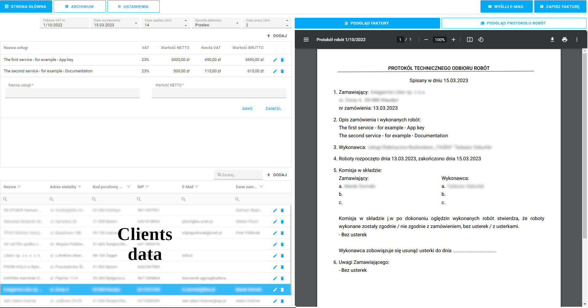
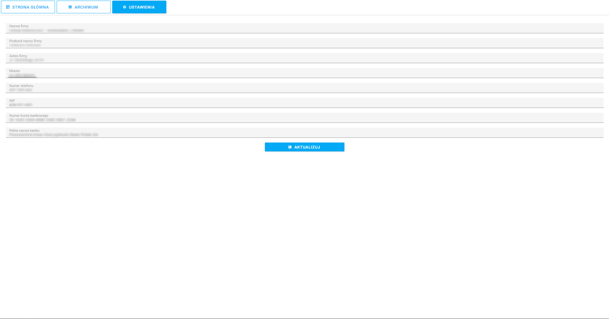

# [Full-Stack Web Application]

## Invoice Generator [1.0.0, early access]

Web application to generate PDF invoices and protocols. 

| Invoice                                | Work protocol                                 |
| -------------------------------------- | --------------------------------------------- |
|  |  |

At the database invoice generator stores your firm and all of your clients' firms data. To generate a new invoice select by a single click client from a lower table. Next add a some services by put the name and price as NETTO (without taxes) value. Application match 23% of taxes and calculates BRUTTO (with taxes) value by self. At the end, set settings from the upper bar, likes: invoice number, creation date, payment time, payment method and spent days for a service. All these input data are used to render invoice and protocol PDF files.

The Invoice Generator also has additional functions. It can be connected with a real e-mail webservice, likes Gmail. With this feature program can log in into e-mail service account and send e-mail with invoice attachment for us. If we do not want to pass our login data of e-mail account we can store generated PDF files at our PC.

The last, useful program feature is Archive module - reads all PDF files stored at program folder. If PDF files were generated with the Invoice Generator, that can read back all invoices data. With this data application can render chart for income series. This kind of history can be used to analyze how the company prospers.

| Firm data settings                                 | Firm invoices archive                  |
| -------------------------------------------------- | -------------------------------------- |
|  |  |

## Technologies:

**ReactJS** [Front-end UI library] - A JavaScript library for building user interfaces.

**DevExtreme** [UI library] - The DevExtreme React Component Suite is a feature-complete set of 70+ responsive and touch-enabled UI components for React applications. The suite includes a data grid, interactive charts, data editors, navigation and multi-purpose UI components.

**NestJS** [Back-end framework] - A progressive Node.js framework for building efficient, reliable and scalable server-side applications.

**SQLite** [DataBase] - SQLite is a C-language library that implements a small, fast, self-contained, high-reliability, full-featured, SQL database engine.

## The most important front-end libraries:

**typescript** - TypeScript is a strongly typed programming language that builds on JavaScript.

**@reduxjs/toolkit** - The official, opinionated, batteries-included toolset for efficient Redux development.

**axios** - Axios is a promise-based HTTP Client for node.js and the browser.

**pdfmake** - Client/Server side PDF printing in pure JavaScript.

**jspdf-autotable** - The plugin which adds the ability to generate PDF tables either by parsing HTML tables or by using Javascript data directly.

## Available Scripts

In the project directory, you can run:

### `npm run front`

Runs the Front-end app in the development mode.\
Open [http://localhost:3000](http://localhost:3000) to view it in the browser.

### `npm run back`

Runs the Back-end app in the development mode.

#### Rest of commends at the NestJS, ReactJS documentations.
